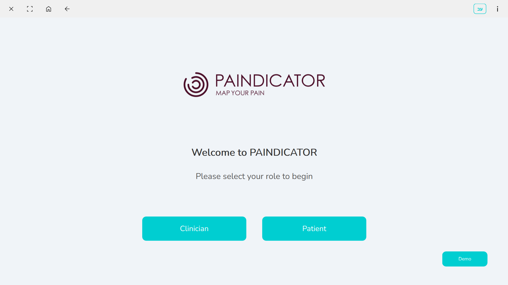
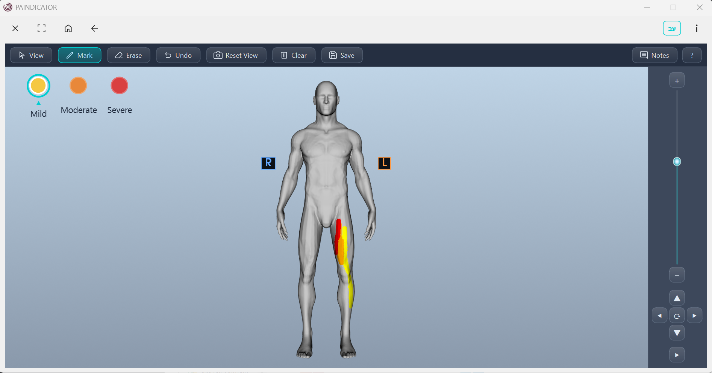
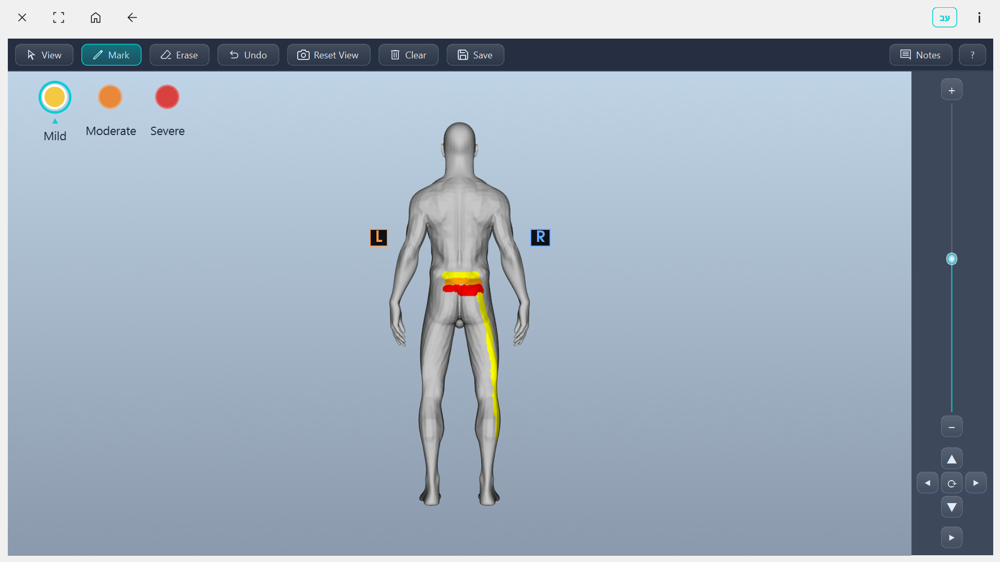
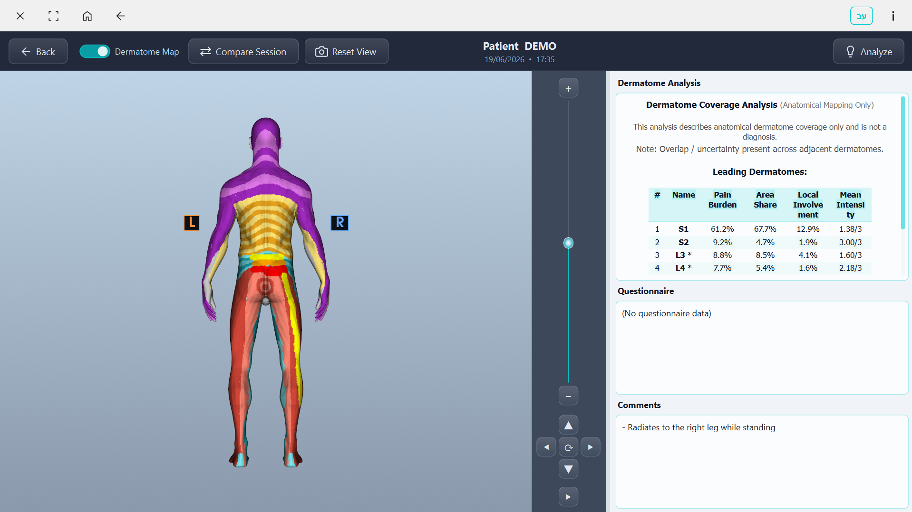

<div align="center">


# PAINDICATOR

**A clinical decision-support system for digital pain mapping and dermatome analysis.**

Built with Python · PyQt6 · VTK

</div>

---

## Overview

PAINDICATOR turns subjective pain reporting into structured, quantitative data. A patient
paints the location and intensity of their pain directly onto an interactive **3D body model**;
the application maps every painted point to its **dermatome** (spinal nerve segment) and produces
per-region coverage and intensity metrics that help a clinician localize and track pain over time.

It is designed for **touch tablets** in a clinical setting, with a guided patient flow and a
separate clinician review interface.

> **Medical disclaimer.** PAINDICATOR is a research/decision-support tool. Its analysis output is
> a descriptive summary of recorded data and **is not a diagnosis** and not a substitute for
> clinical judgment.

---

## Screenshots

<table>
  <tr>
    <td width="50%"><br/><sub><b>Role selection</b> — guided patient or clinician entry</sub></td>
    <td width="50%"><br/><sub><b>Pain painting</b> — per-vertex paint with intensity levels</sub></td>
  </tr>
  <tr>
    <td><br/><sub><b>Posterior view</b> — rotate and paint the whole body</sub></td>
    <td><br/><sub><b>Clinician view</b> — dermatome coverage analysis</sub></td>
  </tr>
</table>

---

## Key features

- **Per-vertex 3D pain painting** - paint, erase, and undo on a male or female anatomical model,
  with three intensity levels and normal-gating so you can't paint "through" the body.
- **Dermatome mapping engine** - every vertex is linked to a dermatome (C1–S5) via a compact
  `.u8` map; painting therefore translates directly into per-dermatome statistics.
- **Coverage analysis** - weighted pain burden, area share, local involvement, mean intensity,
  segmental spread and overlap flags, ranked per dermatome (VTK-free pure-computation core).
- **Clinician review** - replay a saved session, toggle between the painted model and the
  dermatome-region view, click to identify a dermatome, and overlay multiple sessions to compare.
- **Pain-pattern report** - a rule-based summary of dermatome involvement + questionnaire answers,
  surfacing patterns and patient-reported red flags for clinician correlation.
- **Structured questionnaire** - VAS scores, pain character, aggravating/alleviating factors,
  associated symptoms, life impact and more.
- **Tablet-first interaction** - stylus painting, two-finger pinch-zoom / pan / rotate, an
  on-screen gesture guide, and an auto-popup virtual keyboard.
- **Bilingual UI** (English / Hebrew) with live language switching and RTL layout support.
- **Session persistence** - each session is saved as JSON + a human-readable summary +
  front/back screenshots.

---

## How the dermatome pipeline works

```
point_levels (per vertex)                        ← what the patient painted
        │
        ▼
RendererScene.compute_dermatome_coverage_result()
        │
        ▼
dermatome_coverage.compute_dermatome_coverage()  ← pure math, no VTK / no UI
        │
        ▼
structured result: overall stats + ranked dermatomes
        ├──► format_dermatome_coverage_for_display()  → clinician panel
        └──► serialize_dermatome_coverage()           → session JSON
```

Each vertex carries a dermatome ID (`derm_map[vertex_id]`). Because painting is per-vertex, it
maps cleanly onto dermatomes — the model topology and the `.u8` map share the same vertex order.

---

## Architecture

| Layer | File | Responsibility |
|-------|------|----------------|
| Entry point | `codes/app.py` | `QApplication`, `SessionManager`, `MainWindow` |
| Navigation | `codes/ui_main.py` | `QStackedWidget` + fade transitions between screens |
| State | `codes/session_manager.py` | single source of truth for all session data |
| 3D pipeline | `codes/renderer_scene.py` | owns all VTK objects; toolbar-facing API |
| Interaction | `codes/vtk_interactor_custom.py` | paint / erase / camera (per-vertex Paint V2) |
| Analysis | `codes/dermatome_coverage.py` | pure dermatome-coverage computation engine |
| Mapping | `codes/dermatome_mapper.py` | loads the `.u8` dermatome map |
| Decision support | `codes/pain_analyzer.py` | rule-based pain-pattern report |
| Screens | `codes/screens/` | one file per UI screen (patient + clinician flows) |
| Widgets | `codes/widgets/` | toolbar, top bar, comment popup |

**Patient flow:** role selection → patient ID → gender → questionnaire → 3D model → save
**Clinician flow:** clinician name → session selection → session review + analysis

---

## Project Poster

[View Full Poster (PDF)](docs/Paindicator%20-%20Poster%20-%20V3.pdf)

---

## Getting started

Requires **Python 3.11** on Windows.

```bash
# 1. Create and activate a virtual environment
python -m venv venv311
venv311\Scripts\activate

# 2. Install dependencies
pip install -r requirements.txt

# 3. Run from the project root (so data/ and files/ resolve correctly)
python -m codes.app
```

> If you cloned the repository, run `git lfs pull` first to fetch the 3D model binaries.

---

## Building a standalone EXE

```bash
venv311\Scripts\activate
pyinstaller --clean --noconfirm app.spec
# Output: dist/PAINDICATOR/PAINDICATOR.exe
```

The spec bundles the VTK hidden imports plus the `codes/`, `files/` and `data/` directories.
The distributable is the whole `dist/PAINDICATOR/` folder (the EXE needs its `_internal/` siblings).

---

## Project structure

```
PAINDICATOR/
├── codes/                  # application source
│   ├── app.py              # entry point
│   ├── renderer_scene.py   # VTK pipeline owner
│   ├── dermatome_*.py      # mapping + coverage engine
│   ├── pain_analyzer.py    # decision-support report
│   ├── screens/            # UI screens
│   └── widgets/            # toolbar / top bar / popups
├── files/
│   ├── icons/              # UI icons
│   ├── fonts/              # Nunito font
│   ├── pictures/           # logo (other assets local-only)
│   └── models/
│       ├── male model/     # active male model + dermatome map
│       ├── female model/   # active female model + dermatome map
│       └── source/         # original model source (FreeAllOBJ.obj)
├── tools/                  # offline dev/build utilities
├── app.spec                # PyInstaller build spec
├── requirements.txt
└── CLAUDE.md               # detailed architecture & design notes
```

`data/` (patient sessions) is intentionally **not** committed — it stays local for privacy.

---

## Tech stack

- **Python 3.11**
- **PyQt6** — UI, touch & stylus input
- **VTK** — 3D rendering and interaction
- **NumPy** — dermatome map handling
- **PyInstaller** — packaging to a Windows executable
